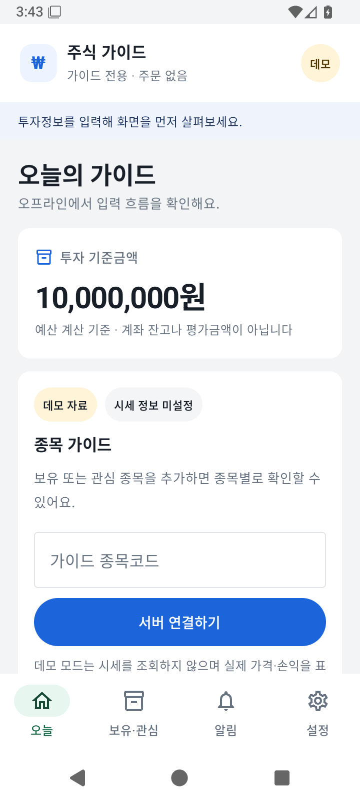
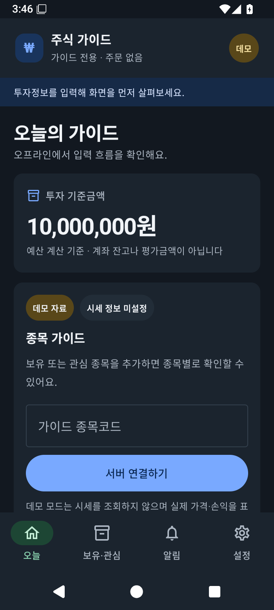

# Stock Guide Agent

Android 앱과 Telegram에서 보유·관심종목을 관리하고 시황과 종목 가이드를 확인하는 프로그램입니다.
**실제 매매는 사용자가 증권사 앱에서 직접 합니다. 봇은 주문을 실행하거나 승인받지 않습니다.**

## Android 앱

`android/`에 Kotlin·Compose 설치형 앱이 있습니다. 외부 키 없이 시작하는 오프라인 데모와
Python 모바일 API 연결 모드를 지원합니다. 오늘·보유/관심·알림·설정 네 화면을 제공하며,
시세가 없을 때 가격이나 수익률을 만들어 표시하지 않습니다.




- [앱 설치·사용·서버 운영 안내](docs/ANDROID_GUIDE_KO.md)
- [개발 계획과 검증 기록](docs/ANDROID_PLAN.md)
- [모바일 API 규격](docs/MOBILE_API.md)
- [실제 검증 결과와 외부 연결 조건](docs/ANDROID_VERIFICATION.md)
- [Android APK 빌드 기록·다운로드](https://github.com/wgcha/stockapp/actions/workflows/verify.yml)

모바일 서버는 Telegram 토큰 없이 실행됩니다. 휴대폰 알림은 평일 09:10 KST의 로컬 확인
리마인더입니다. 아래 Telegram 자동 가이드의 거래일 발송 기능과는 별도입니다.

## 사용 순서

Telegram에서 허용된 사용자 계정으로 봇에 메시지를 보냅니다. 종목은 아래처럼 코드를
사용합니다. 모든 종목명이나 자유로운 표현을 해석하는 기능이 완성됐다고 가정하지 마세요.

```text
도움말
내 투자금은 1,000만원
장기안정 60% 단타 40%, 연간 8%, 하루 손실 1%
보유 005930 10주 평단 70000원
관심 005930, 000660
가이드 005930
005930 어때?
오늘 가이드
매일 가이드 보내줘
```

설정은 한 번에 모두 보낼 필요 없이 변경할 조건만 보낼 수 있습니다. 가이드에는 확보된
시장 근거, 신뢰도, 참고 비중과 손실한도, 판단이 무효가 되는 조건을 표시합니다.
가격·수급이 부족하거나 전략이 검증되지 않았다면 신규매수 대신 대기 판단을 할 수 있습니다.

```text
내 설정
내 보유
관심종목
자동 가이드 꺼줘
```

계좌 금액과 보유정보는 사용자별로 저장됩니다. 증권사 앱에서 거래한 뒤에는 봇의 보유정보도
갱신해야 합니다. 저장된 보유정보가 실제 계좌와 자동으로 일치한다고 가정하지 않습니다.

`005930 1주를 7만원에 사줘`처럼 매매 실행을 요청하면 증권사 앱에서 직접 거래하라는
안내를 받습니다. 주문번호·승인코드를 만들거나 소유자에게 승인 요청을 보내지 않습니다.
기존 `승인`·`거절` 명령도 일반 서비스에서는 주문을 처리하지 않습니다.

## 정기 가이드와 운영 위치

투자조건과 보유·관심종목을 저장한 뒤 `매일 가이드 보내줘`로 신청합니다.
기본 발송창은 KRX 거래일 09:10~09:19 KST이며 늦게 개장하는 날에는 개장 후 10분부터입니다.
휴장일·특수 장시간은 거래소 달력과 운영자가 확인한 공고 보정값을 사용합니다.
`자동 가이드 꺼줘`로 해제할 수 있습니다.

봇은 노트북 또는 상시 서버에서 실행합니다. 노트북 절전·종료·인터넷 단절 시 동작이
중단됩니다. Docker 실행 구성이 있으며 실제 서버 연결·연속 운영은 별도 검증 단계입니다.

## 설치와 실행

PC에서 Telegram 봇을 처음 설정하는 단계는 [PC 빠른 시작](docs/QUICK_START_KO.md)을 참고하세요.
Android 앱은 위의 앱 운영 안내를 따릅니다.

Python 3.11 이상이 필요합니다. 실제 비밀값은 저장소에 넣지 않습니다.
`.env.example`에는 사용할 수 있는 설정과 기본값이 있습니다.
먼저 `python -m pip install .`로 고정된 거래 달력 의존성을 설치합니다.

```powershell
$env:PYTHONPATH='src'
$env:TELEGRAM_BOT_TOKEN='...'
$env:TELEGRAM_OWNER_USER_ID='900'
$env:TELEGRAM_ALLOWED_USER_IDS='30,40'
$env:TOSSINVEST_CLIENT_ID='...'
$env:TOSSINVEST_CLIENT_SECRET='...'
$env:AGENT_DATA_DIR='E:\work\data'
$env:AGENT_EXECUTION_ENV='mock'
$env:AGENT_LIVE_TRADING_ENABLED='false'
$env:TOSSINVEST_LIVE_ORDERS='false'
python -m stock_guide_agent.cli --doctor
python -m stock_guide_agent.cli --run-bot
```

`--doctor`는 설정을 점검하며 실제 연결 성공을 보증하지 않습니다.
노트북에서도 `--env-file .env`로 로컬 설정 파일을 읽을 수 있습니다. `--check-telegram`은
메시지 발송 없이 봇 인증·웹훅 충돌을, `--check-market`은 별도로 인증·현재가 응답을 점검합니다.
시세 점검 전 동일 인증정보를 쓰는 봇을 중지합니다. 자세한 절차와 남은 실제 검증은
[4단계 연결·운영 인수](docs/DEPLOYMENT_ACCEPTANCE.md)를 확인하세요.
`--run-bot --once`는 한 번의 처리 주기를 실행합니다.
`AGENT_EXECUTION_ENV=live`는 거부되며 과거 활성화 플래그를 켜도 실주문은 차단됩니다.
`mock`은 내부 모의평가를 위한 환경명이며 일반 사용자에게 모의주문 기능을 켜지 않습니다.

Docker에서는 로컬 `.env`에 값을 입력합니다.

```powershell
Copy-Item .env.example .env
# .env에 실제 설정을 입력한 뒤 실행
# AGENT_DATA_DIR=/data 유지
docker compose run --rm stock-guide-agent --doctor
docker compose up -d
docker compose logs -f stock-guide-agent
```

비루트 사용자·읽기 전용 루트 파일시스템·제한된 권한으로 실행하며 데이터는 볼륨에 저장합니다.
메시지 재시작 복구와 토큰·개인정보 진단 출력 보호는 로컬 테스트로 검증했습니다.
개발용 실제 SQLite 백업·새 경로 복원도 검증했습니다. 실제 서버 접근권한 적용과 운영 데이터
전환·연속 운영 검증은 후속 단계에 진행합니다.

## 메시지 복구와 보안

봇 하나당 같은 데이터 디렉터리를 사용하는 실행 인스턴스는 하나만 둡니다.
`TELEGRAM_OWNER_CHAT_ID`는 생략하거나 소유자 사용자 ID와 같아야 합니다.
수신 메시지 처리 상태와 답변 대기열은 `messages.sqlite3`에 저장하며 재시작 후 복원합니다.
처리 도중 중단돼 결과가 불명확한 요청은 자동 재실행하지 않습니다. 안내를 받으면
`내 설정`·`내 보유`를 확인한 뒤 필요한 요청만 다시 보내주세요.

답변 전송은 최대 5회 재시도합니다. 응답 유실로 답변이 중복 도착하거나 장시간 장애로
전송되지 않을 수 있습니다. 복구 후 재질문할 수 있습니다. 자동 가이드 발송일 기록도
발송 대기열 등록 기준이며 실제 도착 보증이 아닙니다.

수신 처리 원장에는 원문을 저장하지 않지만, 답변 대기열에는 개인 가이드가 일시 저장됩니다.
DB·WAL·백업을 비밀 설정과 함께 접근 통제해야 합니다. 구체적인 보장 범위, 만료,
권한·키 교체 절차는 [메시지 복구·보안 문서](docs/MESSAGE_RECOVERY_SECURITY.md)를 확인하세요.

## 권한과 내부 전략 연구

- 허용 목록에 등록된 Telegram 사용자만 봇을 사용할 수 있으며 소유자는 자동 포함됩니다.
- 소유자는 `전략현황`, `전략보고 <ID> <버전>`, `연구후보`, `전략승인 <ID> <버전>`,
  `전략중지 <ID> <버전>`으로 전략을 관리합니다. 예: `전략보고 time_series_momentum 1.0.0`.
  전략 보고는 검증 스냅샷과 현재 내부 모의일수를 보여줍니다. 기술 검증 통과는 활성화가 아니며,
  별도 소유자 승인이 필요합니다. 전략 승인은 실주문 권한이 아닙니다.
- `모의현황`과 전략 보고의 현재 모의일수는 내부 모델·모의원장 기록입니다. 실제 계좌 잔고나
  손익이 아니며, 실제 계좌 정보는 사용자가 증권사 앱에서 확인합니다.
- 기존 로컬 DB의 보고서는 API 인증정보 없이 오프라인으로 조회할 수 있습니다. 기존 데이터
  디렉터리를 지정하고 `--strategy-report <ID> <버전>`을 사용합니다. 예:

  ```powershell
  python -m stock_guide_agent.cli --strategy-report time_series_momentum 1.0.0 --data-dir .\data
  ```

  보고 조회는 DB를 만들거나 변경하지 않습니다. 안정적인 결과가 필요하면 봇을 중지하거나
  백업 복사본을 조회하세요. 상세 동작과 자료 부족 표시 기준은
  [전략 검증 문서](docs/STRATEGY_VALIDATION.md)를 확인하세요.
- 소유자의 `거래중단 <사유>`와 `RESET KILL SWITCH`는 가이드·내부 연구의 위험관리
  상태를 관리합니다. 증권사 앱의 실제 주문을 취소하거나 계좌 거래를 중단시키지 않습니다.
- 기존 승인형 모의주문은 내부 연구 코드에서 명시적으로 사용하는 경우만 유지합니다.
  기본 봇에는 이를 켜는 환경 설정이나 사용자 명령이 없습니다. 실주문 차단은 그대로 적용됩니다.

## 개발 상태와 검증

단계마다 변경·검증·제한을 보고하고 **사용자 승인 후 다음 단계에 착수**합니다.
실제 API 연결, 연속 운영 및 전략별 승인·정상 모의일수는 아직 확인하지 않았습니다.

```powershell
$env:PYTHONPATH='src'
python -m unittest discover -s tests -q
```

- [개발 계획과 단계별 완료 기준](docs/DEVELOPMENT_PLAN.md)
- [변경·검증 기록](docs/CHANGELOG.md)
- [거래 달력·정기 작업·백업 운영 도구](docs/OPERATIONS.md)
- [4단계 연결·운영 인수와 실제 검증 대기 항목](docs/DEPLOYMENT_ACCEPTANCE.md)
- [전략 검증 기준과 보고서 해석](docs/STRATEGY_VALIDATION.md)
- [기존 자료 수집·전략 구현 상세 보존본](docs/IMPLEMENTATION_REFERENCE.md)
